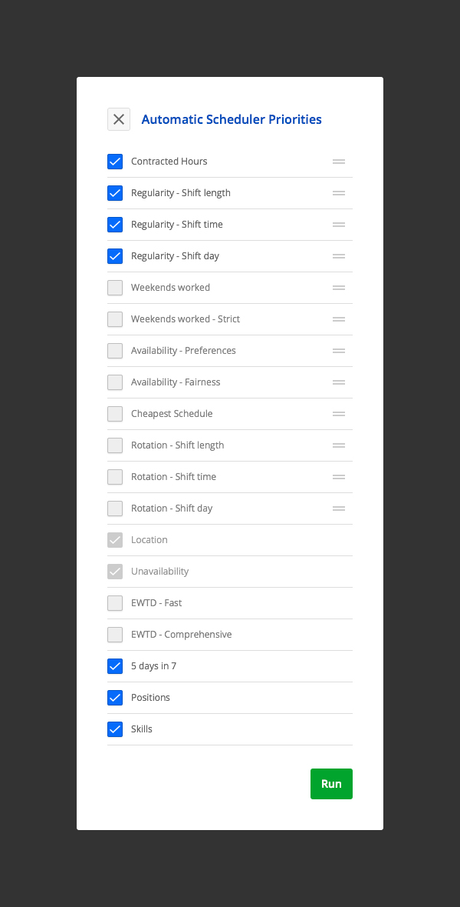
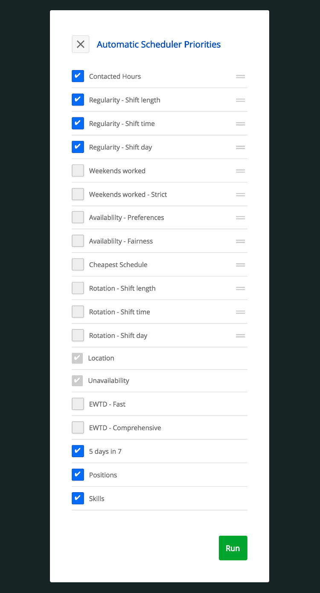

## Niall Rotageek Code Test

Recreate this:

My version:

Live link:
[Niall Modal](https://noccer.github.io/modal/)

## Future Improvements:

- Didn't get the .svg checkbox working in time, so used a standard checkmark for now.
- Need to implement the re-order feature.
- The centring of the x in the close button is a little dodgy. Room for improvement.
- Need to do some refactoring of the CSS (eg: 'pointer: cursor;' etc.).
- The font size of the items on the list looks a little small. Need to investigate further.
